# Seth Pontiff

## Contact Information
📧 Email: [sethpontiff@gmail.com](mailto:sethpontiff@gmail.com)  
💼 LinkedIn: [https://www.linkedin.com/in/sethpontiff/](https://www.linkedin.com/in/sethpontiff/)  
---

## Projects

### Y2PrepHNS
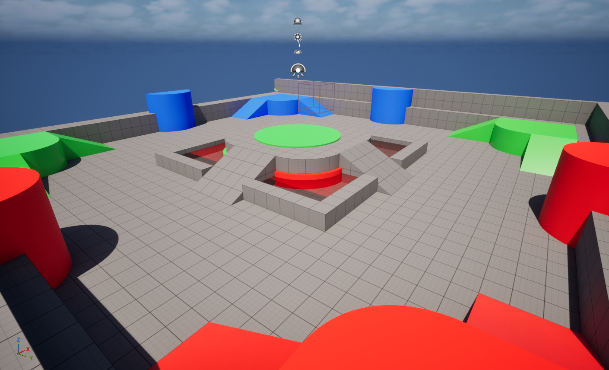
<!-- Replace with your project image path -->

**About**  
A demonstration project focused on Year 2 game development concepts, with an emphasis on networked gameplay.

**Features**
- Network synchronization using RPC calls for multiplayer events
- Data Asset implementation for RPG class defaults and weapon loading
- Team-based spawn system with color-coded player identification
- Physics-based ragdoll death system with automatic respawn functionality

**Media**  
<details>
<summary>Videos & GIFs</summary>


<!-- Add your gameplay videos/GIFs here -->

</details>

**Code & Blueprints**  
<details>
<summary>View Examples</summary>

**Blueprint Systems:**  
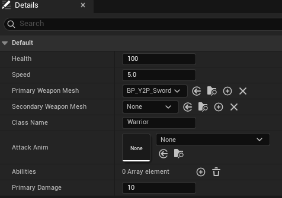  
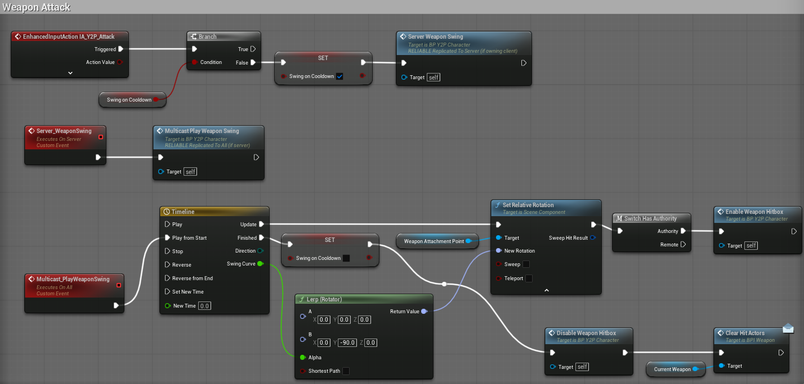  
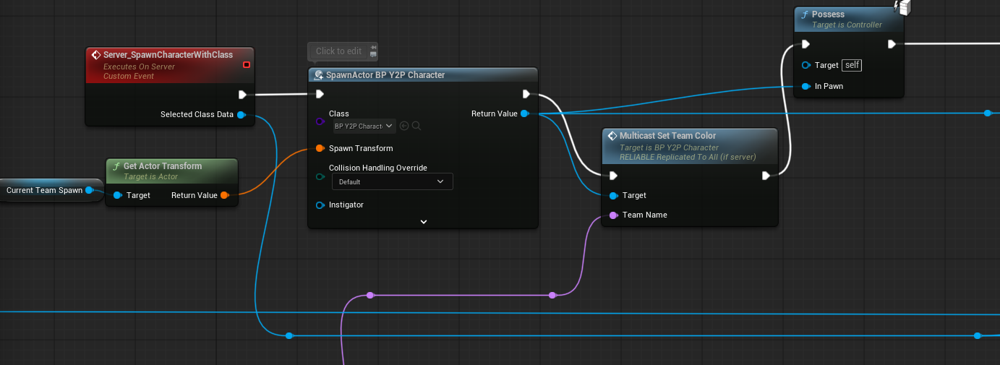  
<!-- Add your UE5.4 Blueprint screenshots here -->

</details>

🔗 [View Repository](https://github.com/SethPontiff/Y2PrepHNS)

---

### UE5-Math-Prototyping
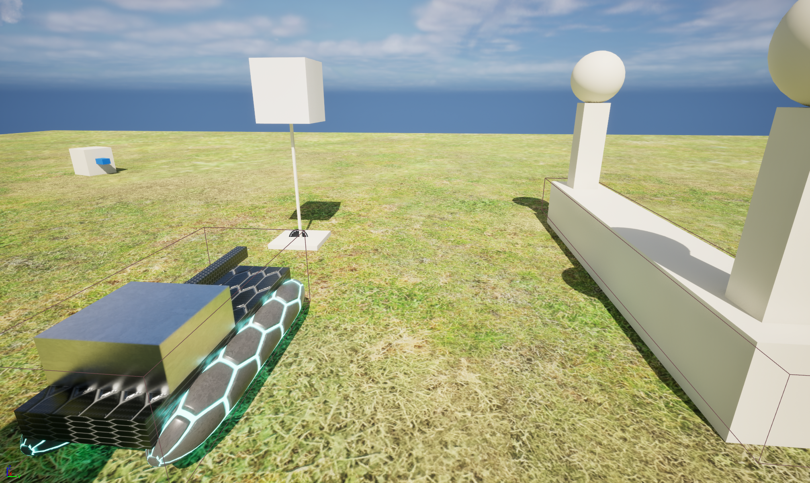

**About**  
A UE5 implementation demonstrating mathematical concepts and their usage in Unreal Engine 5, designed for helping teach game development fundamentals.

**Features**
- Tank movement system with physics-based collision detection
- Sprint and jump mechanics with projectile firing
- AI turret targeting system with rotation and shooting capabilities
- Interactive rotating target with hit detection zones (front, side, back)

**Media**  
<details>
<summary>Videos & GIFs</summary>


<!-- Add your demo videos/GIFs here -->

</details>

**Code & Blueprints**  
<details>
<summary>View Examples</summary>

**Blueprint Systems:**  
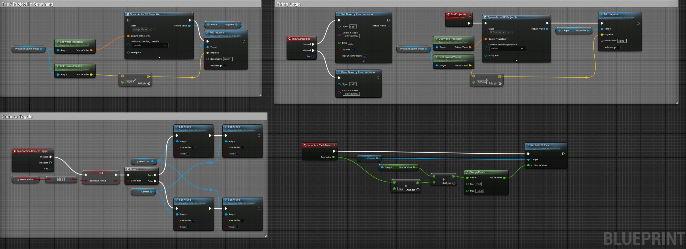  
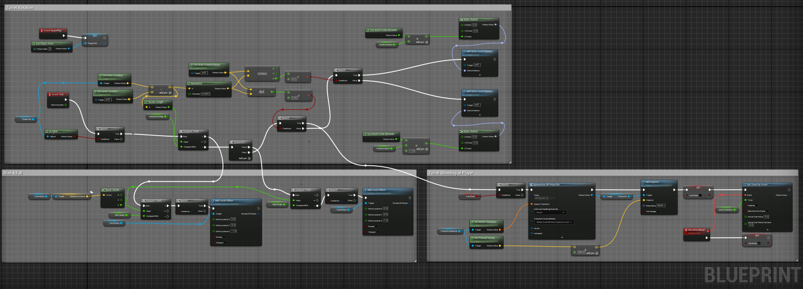  

</details>

🔗 [View Repository](https://github.com/SethPontiff/UE5-Math-Prototyping)

---

### OpenGLTesting

**About**  
A graphics programming project exploring modern OpenGL implementation, focusing on rendering fundamentals and shader programming.

**Features**
- Triangle-based geometry rendering with texture mapping
- Custom shader implementation for visual effects
- Image loading and overlay system
- Planned expansion to 3D rendering

**Resources**  
<details>
<summary>Screenshots</summary>

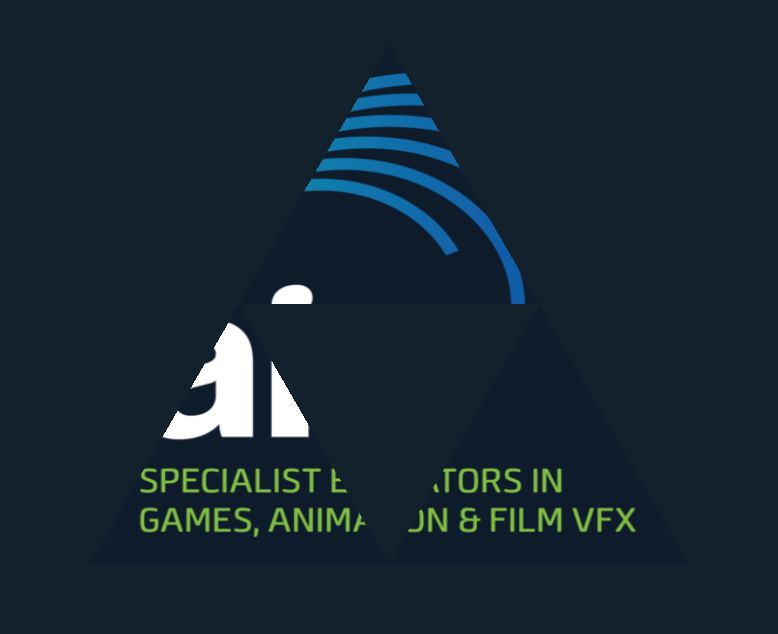
<!-- Add your OpenGL output demos here -->

</details>

**Code & Blueprints**  
<details>
<summary>View Examples</summary>

**C++ Implementation:**
```cpp
#include "shaderClass.h"

std::string get_file_contents(const char* filename)
{
	std::ifstream in(filename, std::ios::binary);
	if (in)
	{
		std::string contents;
		in.seekg(0, std::ios::end);
		contents.resize(in.tellg());
		in.seekg(0, std::ios::beg);
		in.read(&contents[0], contents.size());
		in.close();
		return(contents);
	}
	throw(errno);
}

Shader::Shader(const char* vertexFile, const char* fragmentFile)
{
	std::string vertexCode = get_file_contents(vertexFile);
	std::string fragmentCode = get_file_contents(fragmentFile);

	const char* vertexSource = vertexCode.c_str();
	const char* fragmentSource = fragmentCode.c_str();

	GLuint vertexShader = glCreateShader(GL_VERTEX_SHADER);
	glShaderSource(vertexShader, 1, &vertexSource, NULL);
	glCompileShader(vertexShader);

	GLuint fragmentShader = glCreateShader(GL_FRAGMENT_SHADER);
	glShaderSource(fragmentShader, 1, &fragmentSource, NULL);
	glCompileShader(fragmentShader);

	ID = glCreateProgram();

	glAttachShader(ID, vertexShader);
	glAttachShader(ID, fragmentShader);
	glLinkProgram(ID);

	glDeleteShader(vertexShader);
	glDeleteShader(fragmentShader);
}

void Shader::Activate()
{
	glUseProgram(ID);
}

void Shader::Delete()
{
	glDeleteProgram(ID);
}
```

</details>

🔗 [View Repository](https://github.com/SethPontiff/OpenGLTesting)

---

### Console Commanders

**About**  
A networked turn-based RPG system built with WebSocket technology, featuring client-server architecture for local multiplayer gameplay.

**Features**
- WebSocket-based multiplayer networking for LAN play
- Class selection system with character customization
- Turn-based combat mechanics with boss encounters
- Loot and equipment system with player progression
- Experience and leveling system

**Media**  
<details>
<summary>Images</summary>

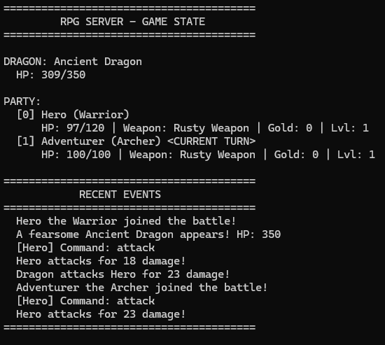
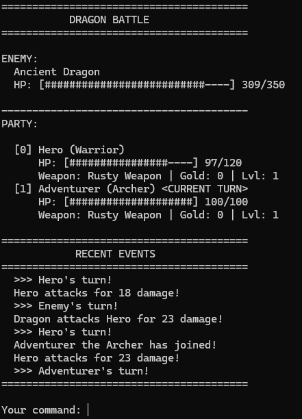
<!-- Add your gameplay videos here -->

</details>

**Code**  
<details>
<summary>View Examples</summary>

**C++ Implementation:**
```cpp
// RPG_Server_combat.cpp
// Implementation of combat system (SERVER)

#include "RPG_Server_combat.h"
#include "RPG_Server_globals.h"
#include "RPG_Server_network.h"
#include "RPG_Server_utils.h"
#include "RPG_Server_enemy.h"
#include <algorithm>

using namespace std;

int calculateDamage(Player& player, bool isCrit) {
    int baseDmg = player.baseAttack + player.weapon.damage;
    int variance = rollDice(-3, 3);
    int damage = baseDmg + variance;

    if (isCrit) {
        damage = static_cast<int>(damage * 2.0);
    }

    return max(1, damage);
}

void playerAttack(Player& player) {
    bool isCrit = (rollDice(1, 100) <= 15);
    int damage = calculateDamage(player, isCrit);

    dragon.hp -= damage;

    string msg = player.name + " attacks for " + to_string(damage) + " damage!";
    if (isCrit) msg += " [CRITICAL HIT!]";

    addToLog(msg);
    broadcastMessage("SERVER:" + msg + "\n");
}

void advanceTurn() {
    totalPlayerTurns++;
    currentTurn = (currentTurn + 1) % players.size();

    while (currentTurn < players.size() && !players[currentTurn].isAlive) {
        currentTurn = (currentTurn + 1) % players.size();
    }

    if (totalPlayerTurns >= players.size()) {
        totalPlayerTurns = 0;
        enemyTurn = true;
        broadcastMessage("TURN:Enemy's turn!\n");
        enemyAttackPhase();
        displayGameState();
        broadcastGameState();
        enemyTurn = false;
        currentTurn = 0;

        while (currentTurn < players.size() && !players[currentTurn].isAlive) {
            currentTurn = (currentTurn + 1) % players.size();
        }
    }

    string turnMsg = "TURN:" + players[currentTurn].name + "'s turn!\n";
    broadcastMessage(turnMsg);
    broadcastGameState();
    displayGameState();
}
```

</details>

🔗 [Client Repository](https://github.com/SethPontiff/RPG_Client) | [Server Repository](https://github.com/SethPontiff/RPG_Server)

> **Status:** Currently on hold while focusing on other projects

---

### 900lbsTechnical

**About**  
A technical demonstration project showcasing augmented reality capabilities and mobile development skills for a Texas-based company.

**Features**
- AR object manipulation in real-world environments
- Mobile-optimized UI and performance
- Real-time cube scaling and color customization
- Touch-based interaction system

**Media**  
<details>
<summary>Videos & GIFs</summary>


<!-- Add your AR demo videos here -->

</details>

**Code Available per Request**  


🔗 [View Repository](https://github.com/SethPontiff/900lbsTechnical)

---

### Astra Customizable Editor

**About**  
A professional character customization tool developed for VRChat integration, featuring advanced model manipulation powered by a proprietary SDK.

**Features**
- Comprehensive character editor with SDK-driven model manipulation
- VRChat integration (previously partnered)
- Advanced customization options for character creation
- Professional-grade UI/UX design

**Media**  
<details>
<summary>Videos & GIFs</summary>


<!-- Add demo videos of the editor here -->

</details>

> **Note:** Full source code is proprietary. Limited snippets and screenshots available per request.


🔗 *Repository available by request*

---

### Exxon Electrical Safety

**About**  
A VR-focused virtual training to teach Exxon employees electrical safety when handling equipment.

**Features**
- Full VR functionality with mockups of real-world tools and a scanned environment,
- Fully guided training that walks through multiple tools and objectives.

**Media**  
<details>
<summary>Screenshots</summary>

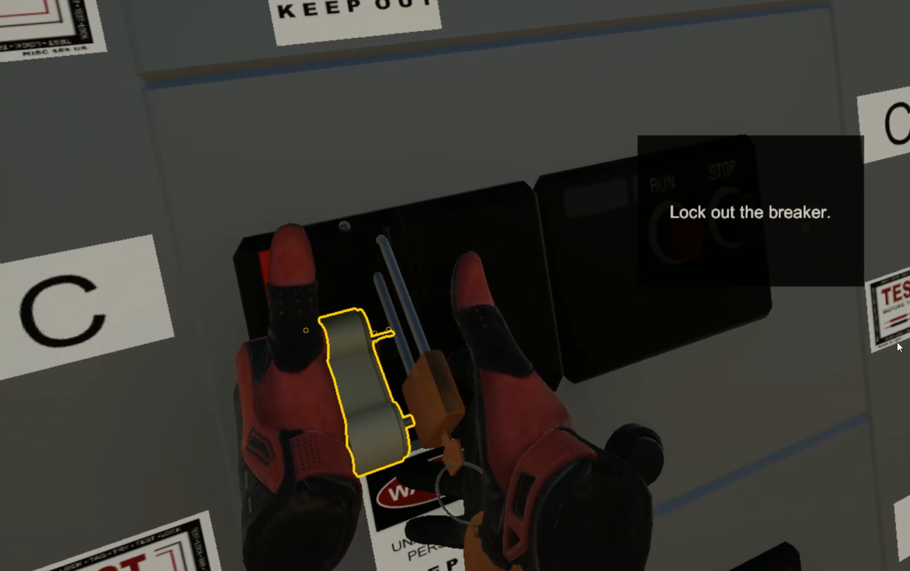

<!-- Add demo videos of the editor here -->

</details>

> **Note:** Full source code is proprietary. Limited snippets and screenshots available per request.


🔗 *Repository available by request*

---

*Last Updated: January 2026*
